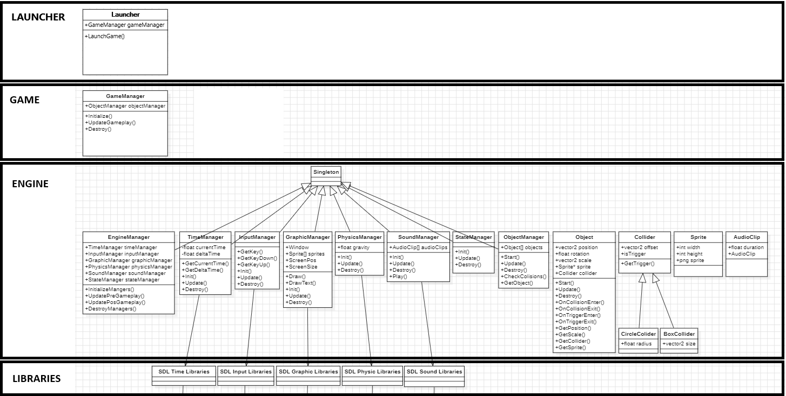

# ⚙️ Custom 2D Game Engine


A robust, multithreaded 2D game engine engineered entirely from scratch using **C++** and the **SDL2** library. 

Rather than relying on out-of-the-box commercial engines, this project was built from the ground up to explore low-level systems architecture, custom memory managers, deterministic physics solvers and thread synchronization. To validate the engine's capabilities, two simple games, a local multiplayer Pong clone and an infinite runner, were developed natively on top of it.

---

## 🏗️ Architecture & Core Systems

The engine is built upon a strict **Singleton template design pattern**, allowing global access to critical managers while securely controlling their construction, execution order and memory allocation lifecycles. 


> *Architectural overview of the custom engine, detailing the strict decoupling between the underlying hardware abstraction (SDL2), the multithreaded core managers and the event-driven gameplay layer.*

### System Modules
* **`EngineManager` (Multithreading):** The heart of the engine. Implements an `SDL_Thread` architecture that strictly separates heavy logic/physics updates from the `GraphicManager`'s rendering loop. Thread synchronization is handled safely via `SDL_mutex`, ensuring data integrity without causing rendering bottlenecks.
* **`Object` Framework (Entity Component):** Acts as the foundation for all game entities. It abstracts the complexity of translation, scale, pivot-point mathematics and sprite rendering. It exposes a Unity-style event lifecycle (`Start`, `Update`, `OnCollisionEnter`, etc.), making gameplay programming highly intuitive.
* **`CollisionManager` (Physics Solver):** A custom physics dispatcher that continuously evaluates an array of dynamic AABB and Circle colliders. It mathematically calculates intersections (including Circle-Square overlap using closest-point bounding logic) and differentiates between "solid" physical collisions and "trigger" volumes.
* **`InputManager`:** Wraps SDL's raw hardware events into a highly queryable interface. Supports simultaneous keyboard, mouse and gamepad inputs, automatically calculating controller dead-zones and providing boolean checks for `GetKeyDown` and `GetKeyUp` states.
* **`SaveManager` (Data Serialization):** Engineered for persistent data storage, parsing and writing structured key-value pairs (Integers, Floats, Strings) directly to local text files.
* **`TimeManager`:** Handles frame-rate independence by calculating `deltaTime` and features a dynamic `timeScale` multiplier to easily implement slow-motion or pause mechanics.
* **`SoundManager`:** A wrapper for `SDL_mixer`, efficiently caching and routing `AudioClip` objects for background music and overlapping sound effects.

---

## 🔬 Technical Highlight: Physics & Collision Dispatch

The collision resolution system calculates exact penetration depths to physically separate solid objects, entirely preventing overlapping or tunneling. When a solid collision is detected, the engine calls `UndoMovement` to forcefully clamp the object back to the exact pixel edge of the colliding surface.

```cpp
void Object::UndoMovement(Collider* _myCollider, Collider* _other)
{
    if (_myCollider->GetIsSquare() && _other->GetIsSquare())
    {
        // Calculate penetration delta based on the previous frame's position 
        // and clamp the current position to the exact edge of the opposing collider.
        if (pos.GetX() > prevPos.GetX())
        {
            pos = Vector2(Clamp(prevPos.GetX(), pos.GetX(), _other->GetParent()->GetXWithoutPivot() + _other->GetLeftX() - _myCollider->GetRightX() + (pos.GetX() - GetXWithoutPivot())), pos.GetY());
        }
        else if (pos.GetX() < prevPos.GetX())
        {
            pos = Vector2(Clamp(pos.GetX(), prevPos.GetX(), _other->GetParent()->GetXWithoutPivot() + _other->GetRightX() - _myCollider->GetLeftX() + (pos.GetX() - GetXWithoutPivot())), pos.GetY());
        }

        // Repeat clamping logic for the Y-Axis
        if (pos.GetY() > prevPos.GetY())
        {
            pos = Vector2(pos.GetX(), Clamp(prevPos.GetY(), pos.GetY(), _other->GetParent()->GetYWithoutPivot() + _other->GetTopY() - _myCollider->GetBottomY() + (pos.GetY() - GetYWithoutPivot())));
        }
        else if (pos.GetY() < prevPos.GetY())
        {
            pos = Vector2(pos.GetX(), Clamp(pos.GetY(), prevPos.GetY(), _other->GetParent()->GetYWithoutPivot() + _other->GetBottomY() - _myCollider->GetTopY() + (pos.GetY() - GetYWithoutPivot())));
        }
    }
}
```

Once physics are resolved, the manager evaluates historical state tracking (comparing the current frame's collision array against the previous frame's) to dynamically dispatch the correct lifecycle events to the gameplay layer:

```cpp
// Evaluate state history to dispatch Enter vs Stay events
if (!colliders[i]->CollidingBeforeIncludes(colliders[j]))
{
    if (!colliders[i]->isTrigger() && !colliders[j]->isTrigger())
        colliders[i]->GetParent()->OnCollisionEnter(colliders[j]);
    else
        colliders[i]->GetParent()->OnTriggerEnter(colliders[j]);
}
else
{
    if (!colliders[i]->isTrigger() && !colliders[j]->isTrigger())
        colliders[i]->GetParent()->OnCollisionStay(colliders[j]);
    else
        colliders[i]->GetParent()->OnTriggerStay(colliders[j]);
}
```

---

## 🎮 Included Games

To test the robustness and scalability of the engine, two complete game modules are included in the repository:

1. **Pong Clone (`Game1Manager`):** A local multiplayer game utilizing the Circle-Square physics solver, directional bouncing math, score tracking, UI text rendering, music and sound effects.
2. **Infinite Runner (`Game2Manager`):** A high-score chasing runner that utilizes the `SaveManager` for persistence, dynamically spawned `Obstacle` objects and the `TimeManager`'s `timeScale` capabilities to halt the engine upon game over.

---

## 🛠️ Dependencies

To compile and run this engine locally, ensure you have the following SDL2 development libraries installed and linked in your C++ build environment:
* `SDL2` (Core Hardware Abstraction)
* `SDL2_image` (Sprite & Texture Loading)
* `SDL2_ttf` (Font Rendering)
* `SDL2_mixer` (Audio Processing)

---
*Developed by [Jokin Oteiza Ollo](https://github.com/Jokin110).*